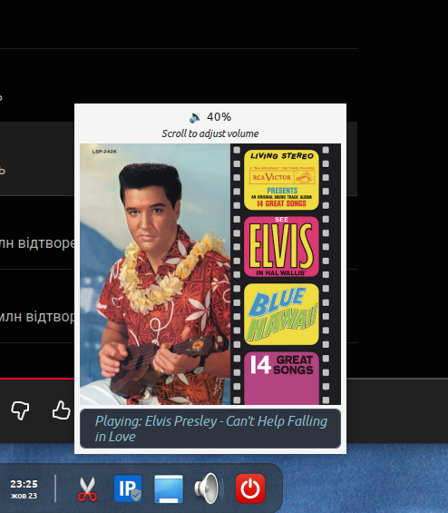

# Volmatic
A Volmatic docklet for [Plank Reloaded](https://github.com/zquestz/plank-reloaded).

## Features
A volume control docklet for Plank Reloaded using wpctl for managing PulseAudio/PipeWire sinks.
- Left-click or hover shows a tooltip popup with current volume.
- Scroll the mouse wheel over the icon to adjust the volume in real time.
- Dynamic icon changes depending on the volume level: muted, low, medium, high.
- Works with PulseAudio and PipeWire using wpctl.

## Dependencies

- vala
- gtk+-3.0
- plank-reloaded
- glib-2.0
- gee-0.8
- wpctl (for volume control)

## Installation

### Method 1: Build from source

```bash
# Clone the repository
git clone https://github.com/androlekss/volmatic-docklet.git
cd quit

# Build and install
meson setup --prefix=/usr build
meson compile -C build
sudo meson install -C build
```
## Setup

After installation, open the Plank Reloaded settings, navigate to "Docklets", and drag and drop Volmatic onto your dock.

## Usage

- Hover over the docklet icon to show the volume popup.
- Scroll the mouse wheel over the icon to increase or decrease volume.
- The icon automatically updates to reflect the volume level:
- 🔇 Muted
- 🔈 Low
- 🔉 Medium
- 🔊 High

- The popup label shows the current volume percentage and hints:
“Scroll to adjust volume”

## Optional: Show current media information

If you'd like VolMatic to display the current track and artist (media info), you need to:
Install playerctl, a command-line utility that interacts with MPRIS-compatible media players:

```bash
# Debian/Ubuntu
sudo apt install playerctl

# Fedora
sudo dnf install playerctl

# Arch Linux
sudo pacman -S playerctl
```
##  Enable the corresponding setting in VolMatic preferences (e.g. Show media info).

Playerctl works with most MPRIS-compatible players, including:
- Spotify
- VLC
- Chrome / Firefox (media tabs)
- Rhythmbox
  and many others
  If playerctl is not installed or no compatible player is running, media info will not be shown.
  
  

## Integration Details

- Uses Plank DockletItem API to handle hover and scroll events.
- Tooltip-style popup is implemented with Gtk.Window (type POPUP).
- Volume is managed via wpctl set-volume <sink_id> <value>.
- Active sink is detected automatically using wpctl status.

## What’s new in 0.1.1

- Initial release with hover popup and scroll-based volume adjustment.
- Automatic icon updates for volume levels.
- Compatible with PulseAudio and PipeWire using wpctl.

## What’s new in 0.1.2

- Add support for media info via playerctl

## License

This project is licensed under the GNU General Public License v3.0 (GPL-3.0). See the LICENSE file for details.

## Contributing

Contributions are welcome! Please feel free to submit a Pull Request.
